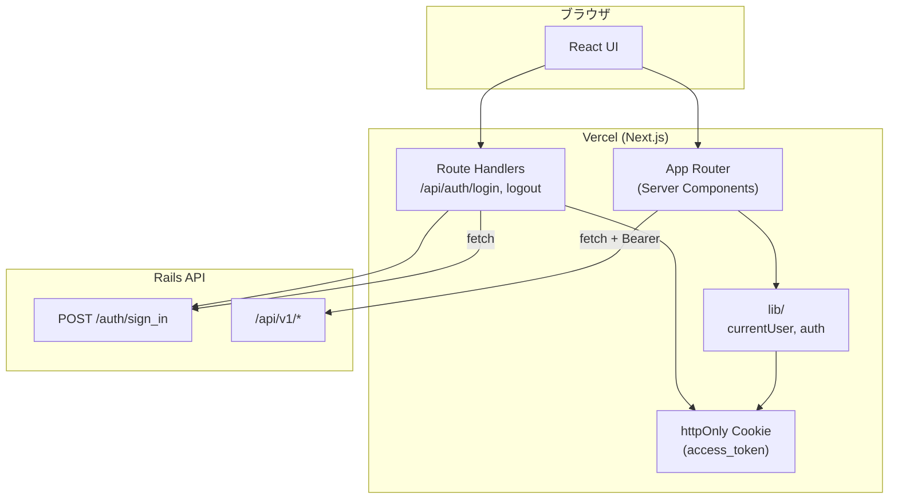

# Portfolio Frontend

タスク管理アプリのフロントエンド(Next.js)です。<br>
[バックエンド](https://github.com/init-tshirai/portfolio-backend) と組み合わせて利用します。

## デモ環境

URL: https://portfolio-frontend-self-psi.vercel.app/ <br>
メールアドレス: normal@example.com <br>
パスワード: password

---

## 目次

- [Portfolio Frontend](#portfolio-frontend)
  - [デモ環境](#デモ環境)
  - [目次](#目次)
    - [使用技術](#使用技術)
  - [アーキテクチャ](#アーキテクチャ)
    - [認証の流れ](#認証の流れ)
    - [認可（フロントエンド側）](#認可フロントエンド側)
  - [画面構成](#画面構成)
    - [ER図・API設計](#er図api設計)
  - [環境変数](#環境変数)
    - [ローカル（`.env.local`）](#ローカルenvlocal)
    - [Vercel](#vercel)
  - [技術選定理由](#技術選定理由)
  - [ローカル環境でのセットアップ](#ローカル環境でのセットアップ)
    - [前提](#前提)
    - [手順](#手順)
  - [デプロイ（Vercel）](#デプロイvercel)
  - [ディレクトリ構成（主要）](#ディレクトリ構成主要)
  - [最後に](#最後に)

---

### 使用技術

フロントエンド: Next.js, Tailwind CSS <br>
バックエンド: Ruby on Rails, MySQL <br>
インフラ: Vercel(Next.js), Railway(Ruby on Rails)

---

## アーキテクチャ



### 認証の流れ

1. `/login` でメール・パスワードを送信
2. `POST /api/auth/login`（Next.js Route Handler）が Rails の `POST /auth/sign_in` を呼ぶ
3. 返却された JWT を **httpOnly Cookie**（`access_token`）に保存
4. 以降、Server Component が Cookie からトークンを読み、Rails API をサーバー側で呼び出す
5. ログアウト時は `DELETE /api/auth/logout` 経由で Rails の sign_out を呼び、Cookie を削除

### 認可（フロントエンド側）

- `GET /api/v1/profile` で権限を取得
- 画面遷移時、権限が無ければ `/forbidden` にリダイレクト
- タスクの「新規作成」リンクなどは権限に応じて出し分け

---

## 画面構成

| パス | 説明 |
|------|------|
| `/login` | ログイン |
| `/` | ログイン後の振り分け（権限に応じて `/tasks` または `/forbidden`） |
| `/tasks` | タスク一覧（検索・ページネーション） |
| `/tasks/new` | タスク新規作成 |
| `/tasks/[id]` | タスク詳細・更新・削除 |
| `/forbidden` | 権限不足（リダイレクトの終端） |

### ER図・API設計

バックエンドの [ER図](https://github.com/init-tshirai/portfolio-backend/#er-%E5%9B%B3) 、 [API設計](https://github.com/init-tshirai/portfolio-backend/#api-%E8%A8%AD%E8%A8%88) を参照してください。

---

## 環境変数

### ローカル（`.env.local`）

```env
NEXT_PUBLIC_API_BASE_URL=http://localhost:3001
```

- **オリジンのみ**指定（末尾スラッシュや`/api/v1` は付けない）
- Rails API を別ポート（例: 3001）で起動している前提

### Vercel

| 変数名 | 例 | 説明 |
|--------|-----|------|
| `NEXT_PUBLIC_API_BASE_URL` | `https://your-api.example.com` | 本番 Rails API の URL |

**Settings → Environment Variables** に設定し、デプロイし直してください。 <br>
`.env.local` は Git の管理対象外のため、Vercel 側での設定が必須です。

---

## 技術選定理由

| 技術 | 選定理由 |
|------|----------|
| **Next.js** | React ベースで画面とサーバー処理をまとめて書ける。API 連携や認証（Cookie）をサーバー側で扱いやすく、Vercel へのデプロイも容易 |
| **TypeScript** | オブジェクトの型を明示するため、保守性に優れる |
| **Tailwind CSS** | CSSフレームワークを利用することで、デザインの標準化が図れる。 |

---

## ローカル環境でのセットアップ

### 前提

- Node.js v24.14.1 のインストール
- [portfolio-backend](https://github.com/init-tshirai/portfolio-backend) のセットアップおよび起動（`http://localhost:3001`）

### 手順

※先頭の$マークは一般ユーザーで操作することを意味します。コマンドには含めないでください。
```bash
$ cd (portfolio-frontend のディレクトリ)
$ npm install
$ cp env.local.example .env.local
$ npm run dev
```

ブラウザで `http://localhost:3000` を開きます。 <br>
ログイン画面が表示されたらフロントエンドの起動は成功です。

以下でログインに成功したらバックエンドとの連携も成功です。 <br>
メールアドレス: normal@example.com <br>
パスワード: password

---

## デプロイ（Vercel）

1. 本リポジトリを Vercel にインポート
2. **Root Directory**: `portfolio-frontend`（モノレポの場合）
3. 環境変数 `NEXT_PUBLIC_API_BASE_URL` に本番 API URL を設定
4. デプロイ

バックエンド API は HTTPS で公開されている必要があります（Cookie に `secure` を付与しており、HTTPS通信時のみCookieが送信されるため）。

---

## ディレクトリ構成（主要）

```
src/app/
  page.tsx              # ログイン後の遷移先振り分け
  login/                # ログイン画面
  forbidden/            # 権限不足時に表示する画面
  tasks/                # タスク CRUD 画面
  api/auth/             # ログイン・ログアウト
  lib/
    auth.ts             # Cookie からトークン取得
    currentUser.ts      # ログイン中ユーザーとその権限を取得
```

---

## 最後に

本アプリケーションは、機能規模だけで言えばRails単体で十分実現可能ですが、 <br>
実務で多い「Rails API + フロントエンド」の構成を一通り設計・実装することを目的として作成しました。

認証、認可の実装方法や、フロントとバックエンドの責務の組み立てに苦労しました。 <br>
将来的に別のクライアント（モバイルアプリなど）が追加された場合も再利用ように、基本的にバックエンドに任せるようにしています。

「Rais API + フロントエンド」の構成はRails単体に比べて環境や言語が分かれるため、デメリットもあると考えます。 <br>
・運用負担向上（環境変数の管理、セキュリティ設定の複雑化） <br>
・可用性低下の危険 <br>
・開発要員確保の難易度増（組織による） <br>
アプリケーションの目的・性質によってはRails単体での開発が最適となる可能性もあるため、実務においては柔軟に判断したいと考えます。
