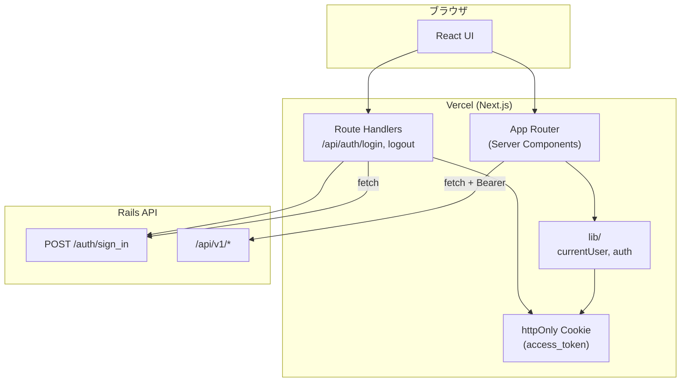

## インフラ構成

```mermaid
flowchart TB
  subgraph Browser["ブラウザ"]
    UI["React UI"]
  end

  subgraph Vercel["Vercel (Next.js)"]
  direction TB
    Pages["App Router\n(Server Components)"]
    RouteHandlers["Route Handlers\n/api/auth/login, logout"]
    Cookie["httpOnly Cookie\n(access_token)"]
    Lib["lib/\ncurrentUser, auth"]
  end

  subgraph API["Rails API"]
    Auth["POST /auth/sign_in"]
    V1["/api/v1/*"]
  end

  UI --> Pages
  UI --> RouteHandlers
  RouteHandlers --> Auth
  RouteHandlers --> Cookie
  Pages --> Lib
  Lib --> Cookie
  Pages -->|"fetch + Bearer"| V1
  RouteHandlers -->|"fetch"| Auth
```
